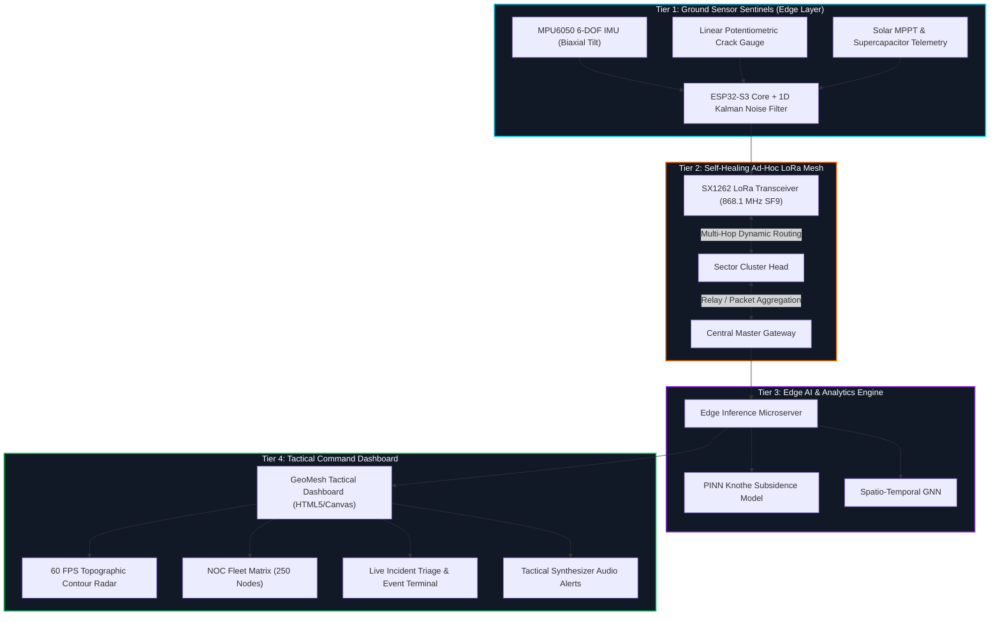

# 🛰️ GEOMESH SENTINEL // AI-ENABLED IoT MESH COMMAND CENTER
### *Autonomous Geographic IoT Mesh Network & PINN Mine Subsidence Early Warning System*

<div align="center">

[](LICENSE)
[](#-problem-statement--context)
[](#-lora-mesh-network-specifications)
[](#-operational-workspaces)
[](#-quick-start)

[**Explore Live Demo**](https://kaushik-g-19.github.io/Geo_sentinal-AI/) • [**System Architecture**](#️-system-architecture) • [**PINN Analytics Lab**](#-ai--physics-informed-modeling-pinn) • [**Quick Start**](#-quick-start)

</div>

---

## 📑 Table of Contents

- [🌟 System Overview](#-system-overview)
- [🎯 Problem Statement & Context](#-problem-statement--context)
- [⚡ Quick Start & Live Deployment](#-quick-start--live-deployment)
- [🛰️ System Architecture](#️-system-architecture)
- [🔬 AI & Physics-Informed Modeling (PINN)](#-ai--physics-informed-modeling-pinn)
- [📊 Operational Workspaces](#-operational-workspaces)
- [📡 LoRa Mesh Network Specifications](#-lora-mesh-network-specifications)
- [🧰 Hardware & Sensor Edge Node Design](#-hardware--sensor-edge-node-design)
- [🔊 Procedural Web Audio FX](#-procedural-web-audio-fx)
- [🌐 Deploying to GitHub Pages](#-deploying-to-github-pages)
- [📜 License & Acknowledgments](#-license--acknowledgments)

---

## 🌟 System Overview

**GeoMesh Sentinel** is an ultra-low latency, mission-critical tactical command dashboard designed for real-time geotechnical slope monitoring and subsidence early warning across underground and open-cast coal mines.

Developed to address catastrophic strata failures, landslide hazards, and ground collapse, GeoMesh Sentinel connects a resilient **decentralized multi-hop LoRa mesh network of 250+ autonomous edge nodes** to an edge-compute command center.

```
┌─────────────────────────────────────────────────────────────────────────────────────────┐
│                               GEOMESH SENTINEL NOC HUD                                  │
├───────────────────┬───────────────────────────────────────────────┬─────────────────────┤
│  TACTICAL RADAR   │  TOPOGRAPHIC ELEVATION & FAULT CONTOUR MAP    │ TELEMETRY SENTINELS │
│  • Hex Geogrid    │  • 60 FPS Canvas Dynamic Render               │ • 250 Active Nodes  │
│  • Node Reticles  │  • Active RF Mesh Communication Links         │ • Real-time RSSI    │
│  • Hazard Cone    │  • Real-time Animated Photon Data Packets     │ • Battery Voltage   │
├───────────────────┴───────────────────────────────────────────────┴─────────────────────┤
│  STREAMING TERMINAL: [13:05] C-7 restored | [13:07] Perimeter anomaly detected Sec-4    │
└─────────────────────────────────────────────────────────────────────────────────────────┘
```

---

## 🎯 Problem Statement & Context

- **Challenge (SIH26025)**: Underground extraction creates subsurface voids causing gradual or sudden surface strata subsidence, threatening surface infrastructure, railway corridors, and personnel safety.
- **Remote & Harsh Pit Conditions**: Cellular/Wi-Fi infrastructure is non-existent or unreliable in deep open pits and rugged topography.
- **The GeoMesh Solution**:
  1. **Self-Healing Multi-Hop LoRa Mesh** operating at 868.1 MHz to circumvent line-of-sight obstructions.
  2. **1D Kalman Filtering** implemented at the ESP32 edge layer for real-time sensor noise reduction.
  3. **Physics-Informed Neural Networks (PINN)** coupled with Knothe time-dependent subsidence theory to forecast ground depression cones before catastrophic breaches occur.

---

## ⚡ Quick Start & Live Deployment

### Instant Local Launch (No Node.js, No Build Tools)
This dashboard is engineered with zero runtime or build dependencies. It executes natively in all modern web browsers:

```bash
# Clone the repository
git clone https://github.com/KAUSHIK-G-19/Geo_sentinal-AI.git

# Navigate into project directory
cd Geo_sentinal-AI

# Open directly in your default browser (Windows)
start index.html

# Or on macOS:
# open index.html

# Or on Linux:
# xdg-open index.html
```

---

## 🛰️ System Architecture

GeoMesh Sentinel implements an end-to-end 4-tier pipeline:



---

## 🔬 AI & Physics-Informed Modeling (PINN)

<details>
<summary><b>Click to expand Knothe Theory & Neural Network Mathematical Formulations</b></summary>
<br>

### Knothe Time-Dependent Subsidence Formulation
Ground subsidence is governed by the Knothe influence function coupled with a dynamic time-decay coefficient:

$$W(x, t) = W_{\text{max}} \cdot \left[ \int_{-\infty}^{x} \frac{1}{r} \exp\left(-\pi \frac{(\lambda - s)^2}{r^2}\right) d\lambda \right] \cdot \left(1 - e^{-c \cdot t}\right)$$

Where:
- $W_{\text{max}} = m \cdot q \cdot \cos(\alpha)$ (Maximum asymptotic ground depression)
- $r = \frac{H}{\tan(\beta)}$ (Radius of primary influence area)
- $H$ = Mining seam depth, $\beta$ = Angle of draw
- $c$ = Time-dependent ground relaxation constant ($0.12\text{ day}^{-1}$)

### Physics-Informed Loss Function
The neural network enforces conservation of mass and geotechnical equilibrium through a composite loss function:

$$\mathcal{L}_{\text{total}} = \mathcal{L}_{\text{data}} + \lambda_{\text{physics}} \cdot \left\| \frac{\partial W}{\partial t} - c(W_{\text{final}} - W(t)) \right\|^2 + \lambda_{\text{smooth}} \cdot \left\| \nabla^2 W \right\|^2$$

</details>

---

## 📊 Operational Workspaces

The command console features six dedicated operational views accessible via the tactical sidebar:

| Mode | Workspace | Capabilities & Visualizations |
| :---: | :--- | :--- |
| 🗺️ | **Tactical Radar & Topo Map** | 60 FPS HTML5 canvas displaying high-resolution mine pit elevation contours, hexagonal coordinate overlay, dynamic LoRa link photons, and interactive node target reticles. |
| 🎛️ | **NOC Fleet Matrix** | High-density grid visualizer inspecting all 250 network nodes. Real-time battery levels, RSSI bars, RF propagation loss, and instant status filtering. |
| 📈 | **Subsidence & PINN Lab** | Interactive Knothe forecasting curves, fissure displacement rate monitors, and angle-of-draw inflection point calculations. |
| 🚨 | **Incident Command & Triage** | 4-Tier mine safety triage (`🟢 NORMAL`, `🟡 WATCH`, `🟠 WARNING`, `🔴 CRITICAL`) with one-click dispatch and emergency siren strobe triggers. |
| 💻 | **Live Streaming Terminal** | Real-time console buffer logging edge events, link reconnects, anomaly alerts, test breach injections, and JSON log export. |
| ⚙️ | **Network Telemetry Config** | Real-time adjustment of LoRa Spreading Factors (SF7–SF12), bandwidth, carrier frequencies, and ESP32 Kalman filter parameters. |

---

## 📡 LoRa Mesh Network Specifications

<details>
<summary><b>Click to expand RF & Network Configuration</b></summary>
<br>

- **Carrier Frequency**: `868.1 MHz` (ISM License-Free Band)
- **Modulation**: LoRa Spread Spectrum
- **Spreading Factor**: `SF9` (Adaptive Data Rate dynamic fallback to SF11 during adverse weather)
- **Bandwidth**: `125 kHz` | **Coding Rate**: `4/5`
- **PDR (Packet Delivery Rate)**: `99.6%` across 5 hops
- **Average Hop Latency**: `12 ms` per hop ($\pm 1.8\text{ ms}$ jitter)
- **Topology**: Hybrid Star-Mesh with Autonomous Sector Cluster Heads

</details>

---

## 🧰 Hardware & Sensor Edge Node Design

<details>
<summary><b>Click to expand Edge Hardware Bill of Materials</b></summary>
<br>

| Subsystem | Component | Specifications |
| :--- | :--- | :--- |
| **Compute Core** | ESP32-S3 Xtensa Dual-Core | 240 MHz, 512 KB SRAM, hardware cryptographic accelerator |
| **RF Transceiver** | Semtech SX1262 | +22 dBm TX power, -137 dBm sensitivity, SPI interface |
| **Tilt Measurement** | InvenSense MPU6050 | 3-axis accelerometer + 3-axis gyroscope with onboard DMP |
| **Displacement** | Linear Potentiometric Crack Gauge | 0.01 mm resolution, 0–100 mm range, IP67 enclosure |
| **Power Harvesting** | Monocrystalline Solar + MPPT | 5V / 2W panel with CN3791 MPPT charging circuit |
| **Energy Storage** | LiFePO4 32700 Cell (6000 mAh) | Extreme temperature resilience (-20°C to +65°C), 3000+ cycle life |

</details>

---

## 🔊 Procedural Web Audio FX

GeoMesh Sentinel includes an onboard procedural audio synthesizer built with the **Web Audio API**:
- **Radar Ping**: Procedural sinusoidal sweep for periodic sector beacon broadcasts.
- **Node Selection Chirp**: High-tech feedback click upon target reticle lock.
- **Emergency Siren**: Dual-tone square-wave frequency modulation strobe for critical tier-4 subsidence breaches.
- **Toggle Mute**: Instantly silence or activate system audio via the speaker icon in the top header.

---

## 🌐 Deploying to GitHub Pages

You can host this dashboard directly on GitHub Pages with **one click**:

1. In your GitHub repository, navigate to **Settings** > **Pages**.
2. Under **Build and deployment** > **Source**, select **Deploy from a branch**.
3. Under **Branch**, select `main` and root `/(root)`.
4. Click **Save**. Within 60 seconds, your tactical dashboard will be live at:
   ```
   https://kaushik-g-19.github.io/Geo_sentinal-AI/
   ```

---

## 👥 Contributors & Acknowledgments

- **Lead Developer**: [KAUSHIK-G-19](https://github.com/KAUSHIK-G-19)
- **Initiative**: Smart India Hackathon (SIH 2026) — Problem Statement **SIH26025**
- **Domain**: Geotechnical Safety, IoT Mesh Networks, & Mining Disaster Prevention

---

<div align="center">
<sub>Engineered for mine worker safety and geotechnical resilience. <b>GeoMesh Sentinel &copy; 2026</b></sub>
</div>
